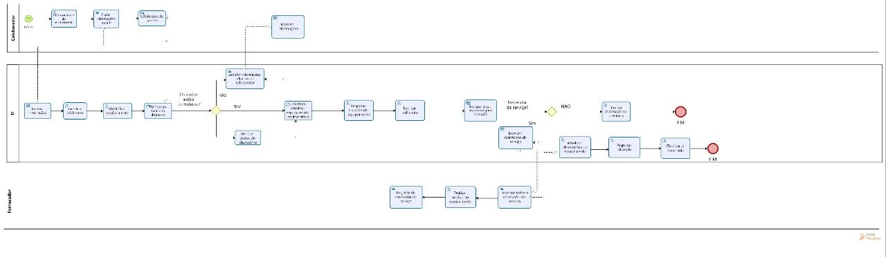
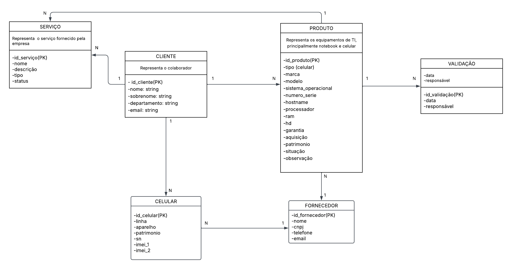

# Entrega-1--Banco-de-dados-
## Metadados

- **Nomes dos alunos e RGM**
- Caroline Barroso de Oliveira RGM:4806351-7
- Danielly Mariano da Costa RGM:4781783-6
- Maria Eduarda Kostkievicz Ferreira RGM:
  
## 1. Caracterização da Organização
- **Nome e natureza da organização:** 
- **Contexto e porte:**
O CNA utiliza recursos da área de TI, para auxiliar em suas atividades. Utilizam serviços TecNews, no qual é uma empresa especializada em serviços de tecnologia da informação, sendo eles: Suporte N1 e N2, Service Desk e Help Desk, monitoração de links e sites, além de suporte e gerenciamento de redes. O volume é baixo; Quantidade de cadastros é menor que 1.000 linhas; As modificações dos dados é feita manualmente; As consultas e operações de leitura e escrita são de baixo volume.

- **Problemas e necessidades identificados:**
- **Justificativa da escolha:**
- **Evidências da organização:**

## 2. Processos de Negócio
- **Principais processos mapeados:** Levantamento e a atualização das informações em planilha dos computadores  e celulares da empresa. Mantendo a organização e atualizações em dia.
- **Fluxogramas:** 
## Diagrama BPMN

## Diagrama de classes

## 3. Requisitos do Sistema
### 3.1 Requisitos Funcionais
- **RF01(Aceitabilidade de cadastro):** O sistema deve cadastrar celulares e computadores, destacando o modelo, fabricante, endereço IP, numero de serie e data de aquisiçao.
- **RFO2(Registro de garantia):** O sistema deve registrar o período de garantia do equipamento e data de fabricaçao.
- **RF03(Observação dos usuários):** O sistema deve permitir o acesso aos dados dos stakeholders nos equipamentos para observaçoes de uso.
- **RF04(Situação dos equipamentos):** O sistema deve registrar a situação predominante no equipamento, destacando as manutenções realizadas; estoque disponível; descartes e defeitos.
- **RF05(Registro de histórico):** O sistema deve disponibilizar um histórico detalhado de alterações e cadastros dos equipamentos registrados.
- **RF06(Consulta de equipamentos):** O sistema deve permitir a busca e leitura dos equipamentos registrados, alteraçoes manuais dos dados e solicitaçao de estoque.
- **RF07(Registro de suporte Tecnews):** O sistema deve registrar as  solicitações de suporte (N1,N2, Help Desk) para a verificação dos equipamentos.

### 3.2 Requisitos Não Funcionais
- **RN01:** O sistema deve restringir o acesso aos dados e alterações apenas para operadores e administradores autorizados pela empresa.
- **RN02:** O sistema deve garantir que o historico de registro e validaçoes nao haja alteraçoes e exclusao.
- **RN03:** O sistema deve ter um limite de 1.000 linhas de cadastro, garantindo otimizaçao em volumes baixos de leitura e escrita.

## 4. Regras de Negócio
- **Regras operacionais:**
- **RN01:** O acesso dos equipamentos deve ser vinculado a um usuario por vez, contendo seus registros. Em casos de alteraçoes, o sistema deve encerrar o processo anterior antes de registrar um novo dado.
- **RNO2:** As alterações realizadas nos equipamentos, incluindo, manutenções, situações de uso e atualização de cadastro, deve ter um registro permanente dentro do histórico de validação. Cada tarefa deve obter a data, horário e identificador do usuário autorizado.
- **RNO3:** Antes de haver manutenção dos equipamentos o sistema deve emitir um aviso prévio aos usuários informando o bloqueio temporário das maquinas para novas operações.           

- **Restrições organizacionais:**
- **RNO1:** Durante o processo de manutenção, o sistema não pode registrar novos colaboradores e nem finalizar inventários ate que o serviço esteja finalizado.
     
## 5. Dicionário de Dados Conceitual
**5.01: Notebook**
| Atributo | Descrição | Regra de negócio associada |
|----------|-----------|------------------------------|
|id| Identificador único do notebook| Chave primaria; deve ser único e obrigatório.|  
|id_colaborador| Identifica o colaborador ao qual o notebook esta vinculado.| Chave estrangeira; deve referenciar um colaborador cadastrado.|
|Marca| Identifica a marca do notebook.| Deve corresponder a uma marca cadastrada.|
|Modelo| Modelo especifico do notebook.| Deve ser informado no cadastro do equipamento.|
|id_sistema_operacional| Identifica o sistema operacional instalado no notebook.| Chave estrangeira; deve referenciar um sistema operacional cadastrado.|
|Serial| Numero de serie utilizado para identificar o equipamento.| Deve identificar o notebook de forma unica.|
|Hostname| Nome utilizado para identificar o notebook na rede/sistema.| Deve ser informado para identificar o equipamento.|
|Processador| Modelo do processador instalado no notebook.| Deve representar o processador do equipamento cadastrado.|
|RAM| Quantidade de memoria RAM do notebook.| Deve representar a capacidade de memoria instalada.|
|HD| Capacidade de armazenamento do notebook.| Deve representar a capacidade de armazenamento do equipamento.|
|Garantia| Informação sobre a garantia do notebook.| Deve registrar a situação ou período de garantia do equipamento.| 
|Aquisição| Informação referente a aquisição do notebook.| Deve registrar a data ou informação de aquisição do equipamento.|    
|Patrimônio| Numero do patrimônio atribuído ao notebook.| Deve identificar o patrimônio do equipamento e não deve se repetir.|   
|Situação| O estado atual do notebook.| Deve indicar a situação atual do equipamento.|

**5.02: Colaborador**
| Atributo | Descrição | Regra de negócio associada |
|----------|-----------|------------------------------|
|id| Identificador único do colaborador| Chave primaria; deve ser único e obrigatório.|  
|Nome| Nome do colaborador| Deve ser informado no cadastro.|
|Sobrenome| Sobrenome do colaborador| Deve ser informado no cadastro.|
|Departamento| Departamento em que o colaborador atua| Deve indicar o departamento ao qual o colaborador pertence.|
|E-mail| Endereço de e-mail do colaborador| Deve ser um e-mail valido e associado ao colaborador.|

**5.03: Celular**
| Atributo | Descrição | Regra de negócio associada |
|----------|-----------|------------------------------|
|id| Identificador único do celular| Chave primaria; deve ser único e obrigatório.|   
|id_colaborador| Identifica o colaborador responsável pelo celular.| Chave estrangeira; deve referenciar um colaborador cadastrado.|
|Linha| Numero ou linha telefônica associada ao celular.| Deve identificar a linha utilizada no equipamento.|
|Aparelho| Modelo do aparelho celular.| Deve ser informado no cadastro.|
|Patrimônio| Numero do patrimônio atribuído ao celular.| Deve identificar o patrimônio do equipamento e não deve se repetir.|  
|Serial_Number| Numero de serie do aparelho.| Deve identificar o celular de forma única.| 
|Imei_1| Primeiro IMEI do aparelho.| Deve corresponder ao IMEI do equipamento.|
|Imei_2| Segundo IMEI do aparelho.| Deve ser informado quando o aparelho possuir segundo IMEI.| 

**5.04: Marcas**
| Atributo | Descrição | Regra de negócio associada |
|----------|-----------|------------------------------|
|id| Identificador único da marca| Chave primaria; deve ser único e obrigatório.| 
|Nome| Nome da marca do equipamento| Deve ser informado e não deve haver marcas duplicadas.|

**5.05: Sistema Operacional**
| Atributo | Descrição | Regra de negócio associada |
|----------|-----------|------------------------------|
|id| Identificador único do sistema operacional.| Chave primaria; deve ser único e obrigatório.|  
|Fabricação| Empresa responsável pela fabricação/desenvolvimento do sistema operacional.| Deve ser informado no cadastro.| 
|Tipo| Tipo ou categoria do sistema operacional.| Deve representar o tipo correspondente ao sistema cadastrado.|
|Versão| Versão do sistema operacional.| Deve identificar a versão instalada no equipamento.|

**5.06: Validação**
| Atributo | Descrição | Regra de negócio associada |
|----------|-----------|------------------------------|
|id| Identificador único da validação.| Chave primaria; único e obrigatório.|
|id_notebook| Identifica o notebook que esta sendo validado.| Chave estrangeira; deve referenciar um notebook cadastrado.|
|Data| Data em que a validação foi realizada.| Deve conter uma data valida e ser registrada no momento da validação.|
|Responsável| Identifica o responsável pela realização da validação.| Deve registrar o responsável pela validação.|

## 6. Modelagem Conceitual (Entidades, Atributos, Relacionamentos)
- **Entidades reconhecidas:**

   **Colaborador:** Representa os funcionários da empresa que utilizam ou são responsáveis pelos equipamentos.

  **Celular:** Representa os aparelhos celulares disponibilizados pela organização aos colaboradores, contendo informações de identificação e características do equipamento.

  **Notebook:** Representa os notebooks utilizados na empresa , armazenando informações de identificação, configuração, aquisição, garantia e situação do equipamento.

  **Marcas:** Representa as marcas dos notebooks cadastrados, permitindo organizar e identificar a marca de cada equipamento.

  **Sistemas_operacionais:** Representa os sistemas operacionais utilizados nos notebooks, armazenando informações sobre fabricação, tipo e versão.

  **Validação:**  Representa os registros de validação dos notebooks, permitindo acompanhar quando o equipamento foi validado e quem foi o responsável.  

- **Atributos e classificações:**

| Entidade | Atributos |
|----------|-----------|
| Colaborador| id, Nome, Sobrenome, Departamento, E-mail|
| Celular| id, id_colaborador, Linha, Aparelho, Patrimônio, Serial_number, Imei_1, Imei_2|
| Notebook| id, id_colaborador, Marca, Modelo, id_sistema_operacional, Serial, Hostname, Processador, RAM, HD, Garantia, Aquisição, Patrimônio, Situação.|
|Marcas| id, Nome|
|Sistema_operacional| id, Fabricação, Tipo, Versão.|
|Validação| id, id_notebook, Data, Responsável.|  

- **Relacionamentos pertinentes:**

**Colaborador ➝ Celular**

Um colaborador pode estar associado a celulares, e o celular possui o id_colaborador para identificar seu responsável. 

**Colaborador ➝ Notebook**

Um colaborador pode estar associado a notebooks, enquanto cada notebook cadastrado possui um colaborador associado por meio de id_colaborador. 

**Marcas ➝ Notebook**

Uma marca pode estar relacionada a vários notebooks, enquanto cada notebook possui uma marca associada. 

**Sistema_operacional ➝ Notebook**

Um sistema operacional pode estar associado a vários notebooks, enquanto cada notebook possui um sistema operacional identificado por id_sistema_operacional. 

**Notebook ➝ Validação**

Um notebook pode possuir registros de validação, permitindo registrar a data e o responsável por cada validação. 

-**Restrições e políticas organizacionais aplicadas ao modelo.**

- Cada entidade possui um identificador único (id), utilizado para diferenciar seus registros.
- As chaves estrangeiras devem corresponder a registros existentes nas entidades relacionadas.
- Um notebook tem que estar vinculado a um colaborador cadastrado.
- Um celular deve estar vinculado a um colaborador cadastrado.
- Um notebook deve possuir uma marca cadastrada.
- As informações de identificação dos equipamentos, como patrimônio e numero de serie, devem permitir identificar cada equipamento.
- As validações devem estar vinculadas a um notebook existente.
- A validação deve registrar a data e o responsável pela realização do procedimento.

## 7. Diagrama Entidade-Relacionamento (DER)

## Diagrama Entidade-Relacionamento

## 8. Justificativa Técnica

## 9. Uso de Inteligência Artificial

| Item | O que registrar |
|------|------------------|
| **Ferramenta e etapa** | A IA utilizada foi o **Chat gpt** como material de apoio como auxilio de identificação de erros inseridos no fluxograma.| 
| **Motivação** | Com base nas informações fornecidas, utilizamos a Inteligência Artificial para corrigir possíveis erros que poderiam estar contidos no sequenciamento dos fluxogramas.|   
| **Prompt(s) utilizados** |“Atue como professor e detecte possíveis erros presentes no fluxogramas.Em seguida, anexamos a imagem do fluxograma feito para que a IA analisasse.|
| **Resposta recebida** |Claro. Vou analisar como professor, usando como referência o material que você enviou e comparando com o BPMN que você montou. O objetivo aqui é identificar erros, inconsistências e pontos que podem gerar desconto, e não apenas dizer que está certo ou errado. A lógica do processo está correta, mas existem alguns pontos que precisam ser ajustados no BPMN. Os principais problemas estão na conexão dos fluxos, especialmente na comunicação entre **TI → Fornecedor → TI**, e no retorno dos dados incompletos para uma nova verificação. O processo deve manter os três participantes: **Colaborador, TI e Fornecedor**. O Colaborador envia as informações para a TI, que identifica o colaborador e o equipamento, verifica os dados e decide se estão completos. Se não estiverem, deve solicitar as informações novamente. Se estiverem completos, a TI realiza o cadastro/atualização, registra a situação e verifica se é necessário serviço. Quando houver necessidade de serviço, a solicitação deve ser enviada ao **Fornecedor**, que realiza o serviço e informa a conclusão à TI. Depois disso, a TI atualiza as informações, registra a situação e finaliza o processo. Portanto, não é necessário refazer o BPMN do zero. Basta corrigir as conexões gráficas, diferenciar corretamente os fluxos de mensagem e garantir que os dois caminhos de finalização estejam representados.|
| **Fontes consultadas e verificadas** |A IA não emitiu site específico no momento da pesquisa, entretanto, verificamos nos respectivos sites: https://www.devmedia.com.br/amp/orientacoes-basicas-na-elaboracao-de-um-diagrama-de-classes/37224; https://lucid.co/pt/diagrama/bpmn/tutorial; https://www.devmedia.com.br/amp/mer-e-der-modelagem-de-bancos-de-dados/14332|
| **Trechos rejeitados ou corrigidos** | Corrigimos partes da estrutura que pareciam errôneas, como as atividades que estavam na lane "fornecedor" do bpmn “Atualizar informações do equipamento”, “Registrar situação” e “Finalizar inventário”, após analisar que pareciam sem sentido no fluxograma, detectando como um erro. Porém, essas informações estavam descritas de acordo com a nossa montagem de dados emitidos, por esse motivo que descartamos essa sugestão da IA.|  
| **Justificativa da escolha final** | Utilizamos a Inteligência Artificial como um apoio de revisão no trabalho, tendo em vista que cada etapa realizada de forma autorial foi mantida segundo os requisitos coletados da empresa.|
| **Reflexão crítica** | Ao inserir o prompt e a imagem do fluxograma feito, a IA apresentou vieses ao sugerir a retirada de determinadas atividades previstas no esqueleto autoral, pontuando como desnecessária na compreensão do projeto. Verificamos em outros sites sobre a forma correta de fazer a montagem, desvinculando o uso exclusivo da IA como fonte única.|
